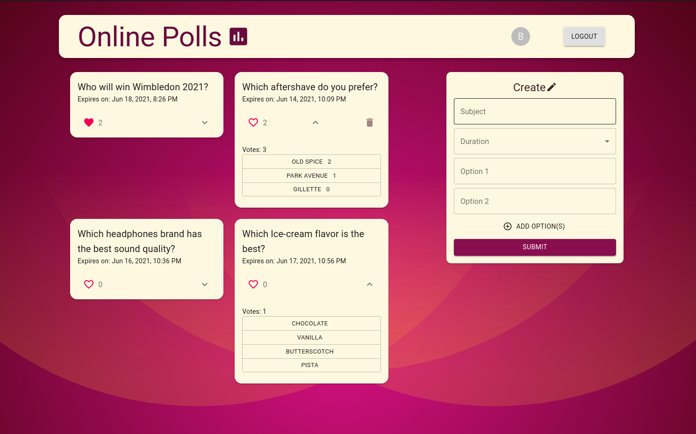

# Online Polls App

### [*Link to Live Hosting*](https://online-polls-app.netlify.app/)

---------

---------

### Tech Stack: MERN
* ReactJS (along with Material-ui)
* Redux
* Node.js
* Express
* Authentication using Bcrypt & JWT, along with Google OAuth
* MongoDB

### Features:
* Users can register, login and logout (Authentication).
* Registered users can make an entry of poll with it's subject, duration for which poll remains active, and options vote for.
* Registered users can like and vote once on any poll.
* Registered users can delete any polls they authored.

### Deployment
* Front-end on Netlify
* Back-end on Heroku
* Database on MongoDB Atlas